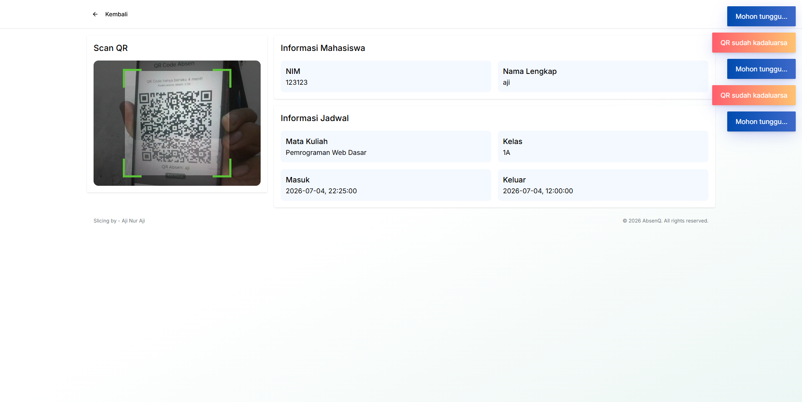

# AbsenQ

AbsenQ is a QR code-based attendance system designed for classrooms and lectures. Students generate their own QR code, which remains valid for a short time, while lecturers can scan it using a laptop or phone camera to mark attendance quickly.

This project was built as a final assignment for a basic web programming course and uses a lightweight native PHP MVC structure with MySQL.

## Demo Gallery
Here are some screenshots from the application:





## Features
- Time-limited QR codes with a short validity window
- One-time QR usage to prevent duplicate attendance
- Real-time countdown synchronization with the server
- Camera-based scanning from desktop or mobile devices
- Check-in and check-out validation
- Student dashboard with recent attendance and upcoming schedules
- Authentication and role-based middleware
- Simple custom MVC router

## Tech Stack
- Backend: PHP 8.4+, Composer, PDO MySQL, native MVC architecture
- QR generation: Endroid QR Code
- Frontend: HTML, CSS, JavaScript
- Environment: Docker, Apache, MySQL, phpMyAdmin

## Project Structure
```text
absenq/
├── app/
│   ├── Controllers/
│   ├── Core/
│   ├── Helpers/
│   ├── Middlewares/
│   ├── Models/
│   └── Views/
├── demo/
│   └── index.html
├── docker/
├── public/
├── routes/
├── sql/
└── storage/
```

## Installation and Setup
### 1. Clone the repository
```bash
git clone https://github.com/ajinuraji/absen-php-native.git absenq
cd absenq
```

### 2. Start the containers
```bash
docker compose up --build -d
```

### 3. Prepare the database
- Open phpMyAdmin at http://localhost:8081
- Import the SQL file from [sql/database.sql](sql/database.sql)
- The script creates the `absenq` database and the default admin account

### 4. Configure the environment
A workspace environment file is already included. If needed, update the values in [.env](.env) to match your local setup.

### 5. Open the app
Visit http://localhost:8000

### 6. Log in
Default credentials:
- Username: `admin`
- Password: `admin`

## Contributors
- Aji Nur Aji
- Indah Suci Ramadani
- Nessya Cipto Meilody

Pull requests are welcome. Please open an issue for bugs or feature requests.

## License
MIT License
